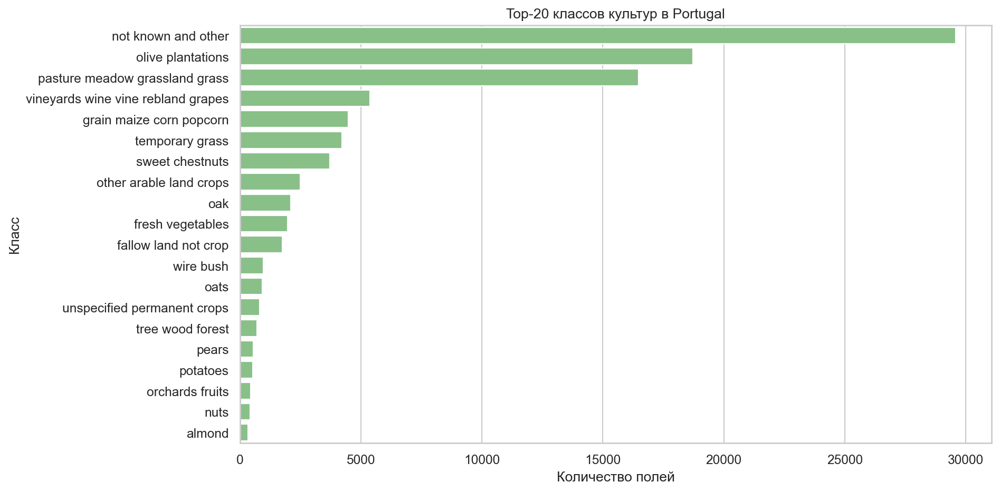
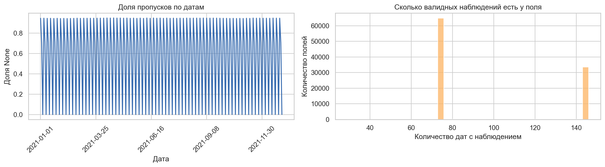
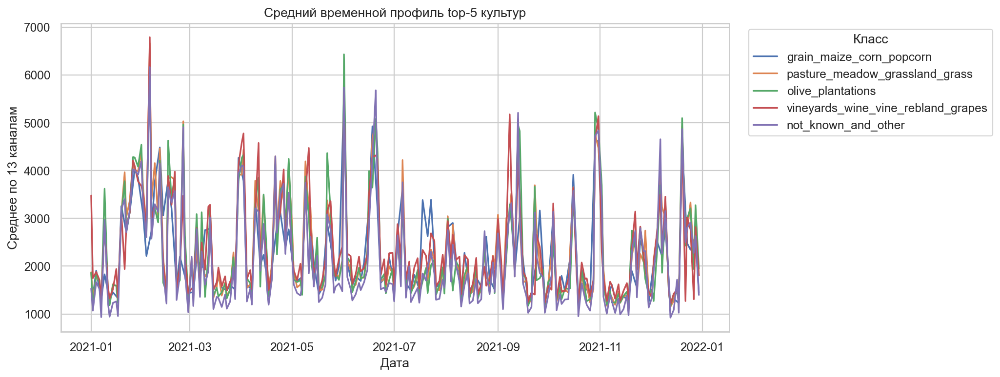
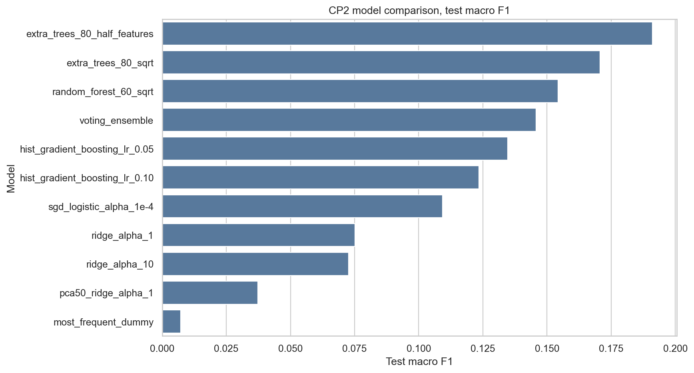
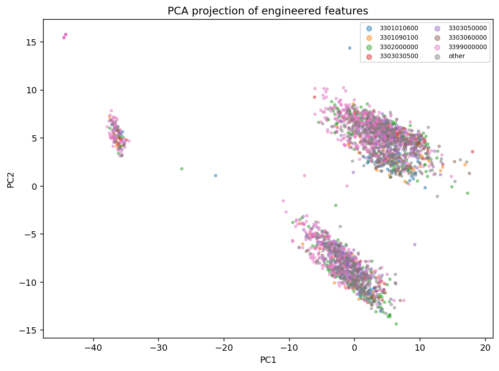
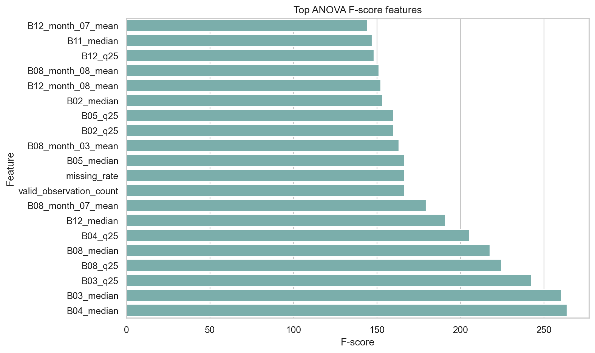
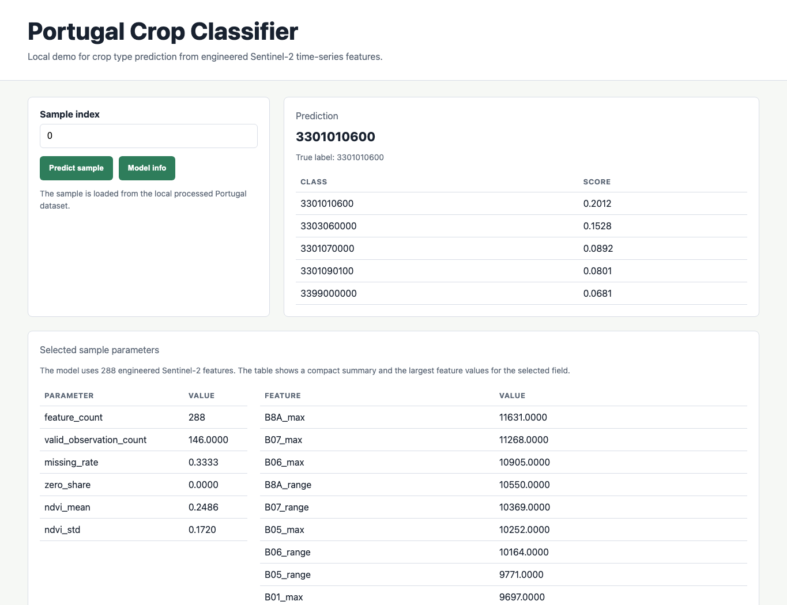
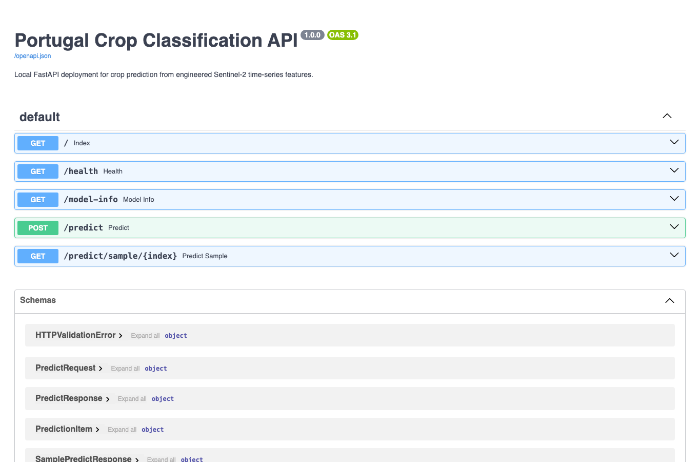

# Отчёт по проекту

**Студент:** Юдинцев Владимир Алексеевич<br>
**Группа:** БИВ232

## 1. Введение и постановка задачи

Задача проекта — определить тип сельскохозяйственной культуры на поле по мультиспектральному временному ряду Sentinel-2.

Это многоклассовая классификация. Основная метрика — **macro F1**, потому что классы сильно несбалансированы: самый частый класс можно угадывать часто, но такая модель почти не работает для редких культур. Accuracy оставлена как дополнительная метрика, чтобы видеть общую долю верных ответов.

## 2. Поиск и описание данных

Источник данных — EuroCropsML на Zenodo: https://zenodo.org/records/15095445. Датасет подходит напрямую: в нём есть Sentinel-2 reflectance за 2021 год и классы культур для Latvia, Portugal и Estonia.

Для проекта выбран Portugal subset из `raw_data.zip`, потому что это самая компактная страна и её удобно обработать локально. В Zenodo нет отдельного архива только для Portugal, поэтому файлы извлекались из общего `raw_data.zip`.

Размеры файлов Zenodo v11:

| Файл | Размер |
|---|---:|
| `split.zip` | 20.7 MB |
| `preprocess.zip` | 1.47 GB |
| `raw_data.zip` | 3.28 GB |

Portugal raw subset:

| Параметр | Значение |
|---|---:|
| Строк | 100 000 |
| Столбцов | 225 |
| Дат наблюдений | 219 |
| Sentinel-2 каналов на дату | 13 |
| Классов до фильтрации | 79 |

Для CP2 после удаления классов с числом объектов меньше 3 осталось 99 983 поля, 66 классов и 288 engineered-признаков.

## 3. Обработка и подготовка данных

Данные разбирались из `Portugal.parquet`. Целевая переменная — `EC_hcat_c`.

Что было сделано:

- проверены типы, дубликаты `parcel_id`, согласованность labels;
- изучены пропуски по датам: средняя доля пропусков около 55.2%;
- временные списки Sentinel-2 раскрыты в числовые признаки `float32`;
- для baseline пропущенное наблюдение заменялось нулевым 13-мерным вектором;
- для CP2 построены агрегаты по каналам, месяцам и спектральным индексам;
- сделан собственный stratified train/validation/test split 60/20/20 с `RANDOM_SEED = 42`.

Data leakage избегался так: разбиение выполняется по полям, а не по отдельным датам одного поля.

Основные визуализации:







## 4. Baseline-модель

Baseline — `SGDClassifier(loss="log_loss")` со `StandardScaler`, без feature engineering. Признаки только разворачиваются в матрицу `date x band`: 219 дат × 13 каналов = 2847 признаков.

| Модель | Split | Accuracy | Balanced accuracy | Macro F1 |
|---|---|---:|---:|---:|
| Most frequent dummy | test | 0.296 | 0.016 | 0.007 |
| SGD Logistic baseline | validation | 0.291 | 0.246 | 0.136 |
| SGD Logistic baseline | test | 0.288 | 0.220 | 0.126 |

Вывод: по accuracy baseline похож на dummy, но macro F1 и balanced accuracy намного выше. Значит, модель всё же учит различия между культурами, а не просто выбирает самый частый класс.

## 5. Эксперименты

Все эксперименты обучались на одном split и сравнивались по macro F1.

| Эксперимент | Гипотеза | Как проверялось | Test macro F1 | Test accuracy |
|---|---|---|---:|---:|
| Dummy | Нужна нижняя планка качества | `DummyClassifier(strategy="most_frequent")` | 0.007 | 0.296 |
| Logistic baseline | Линейная модель даст простой baseline | `SGDClassifier` на baseline-признаках | 0.126 | 0.288 |
| SGD on engineered | Агрегаты улучшат линейную модель | `SGDClassifier` на 288 engineered-признаках | 0.109 | 0.442 |
| Ridge alpha=1 | Линейная модель с L2 может быть стабильнее | `RidgeClassifier(alpha=1)` | 0.075 | 0.151 |
| Ridge alpha=10 | Более сильная регуляризация может помочь | `RidgeClassifier(alpha=10)` | 0.073 | 0.146 |
| RandomForest | Деревья лучше ловят нелинейности | `RandomForestClassifier` | 0.154 | 0.542 |
| ExtraTrees sqrt | Более случайный ансамбль может обобщать лучше | `ExtraTreesClassifier(max_features="sqrt")` | 0.171 | 0.534 |
| ExtraTrees 0.5 | Больше признаков на split может улучшить качество | `ExtraTreesClassifier(max_features=0.5)` | 0.191 | 0.557 |
| HistGB lr=0.05 | Бустинг может лучше работать на табличных агрегатах | `HistGradientBoostingClassifier(learning_rate=0.05)` | 0.135 | 0.541 |
| HistGB lr=0.10 | Более быстрый learning rate может быть достаточным | `HistGradientBoostingClassifier(learning_rate=0.10)` | 0.123 | 0.530 |
| PCA50 + Ridge | Сжатие размерности может убрать шум | `StandardScaler -> PCA(50) -> Ridge` | 0.037 | 0.057 |
| Voting ensemble | Голосование моделей может улучшить устойчивость | Ridge + ExtraTrees + RandomForest | 0.146 | 0.531 |

Лучший результат дал `ExtraTreesClassifier(max_features=0.5)`. PCA оказался слабым: при сжатии теряются сезонные и нелинейные различия между классами.





## 6. Финальная модель и интерпретируемость

Финальная модель:

```text
ExtraTreesClassifier(
    n_estimators=80,
    max_features=0.5,
    min_samples_leaf=2,
    class_weight="balanced",
    random_state=42
)
```

Она выбрана по лучшему validation macro F1. На test модель получила:

| Метрика | Значение |
|---|---:|
| Macro F1 | 0.191 |
| Accuracy | 0.557 |
| Balanced accuracy | 0.173 |

Для интерпретируемости использован ANOVA F-score по train split. Самые полезные признаки — медианы и квартили каналов B03/B04/B08, июльский B08, `valid_observation_count` и `missing_rate`. Эти признаки описывают уровень отражения, сезонность и полноту временного ряда.



## 7. Деплой

Деплой реализован как локальный FastAPI-сервис. После запуска доступны HTML-интерфейс и HTTP API.

Один объект описывается 288 engineered-признаками, рассчитанными из спутникового временного ряда. Ручной ввод таких данных в интерфейсе не используется: поля признаков включают статистики по каналам, месяцам и индексам. В UI объект выбирается по индексу из подготовленного Portugal dataset; интерфейс показывает основные параметры выбранного объекта и результат предсказания. Endpoint `POST /predict` предназначен для случая, когда другой сервис уже подготовил 288-мерный вектор признаков.

Команды запуска:

```bash
make features
make train-final
make api
```

После запуска:

- UI: http://localhost:8000/
- Swagger/OpenAPI: http://localhost:8000/docs
- healthcheck: http://localhost:8000/health

Основные endpoints:

| Endpoint | Что делает |
|---|---|
| `GET /health` | Проверяет, что сервис работает |
| `GET /model-info` | Возвращает информацию о модели, признаках и split |
| `POST /predict` | Принимает 288 признаков и возвращает предсказание |
| `GET /predict/sample/{index}` | Берёт объект из локального processed dataset, показывает его параметры и предсказывает класс |
| `GET /` | HTML-страница для демонстрации sample-based предсказания |

Скриншоты работы:






## 8. Заключение и выводы

В проекте разобран Portugal subset EuroCropsML, проведён EDA, подготовлены baseline и engineered-признаки, обучены линейные модели, ансамбли деревьев, gradient boosting, PCA-вариант и voting ensemble.

По итогам экспериментов деревья на агрегированных временных признаках работают лучше простого baseline. Итоговая модель даёт test macro F1 0.191 и accuracy 0.557. Основное ограничение результата — сильный дисбаланс классов и 66 классов после фильтрации редких культур.
